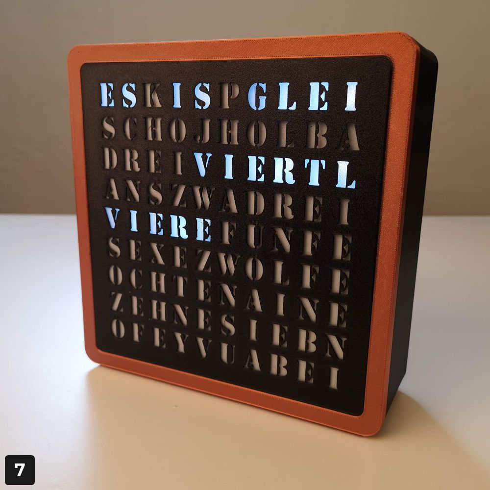
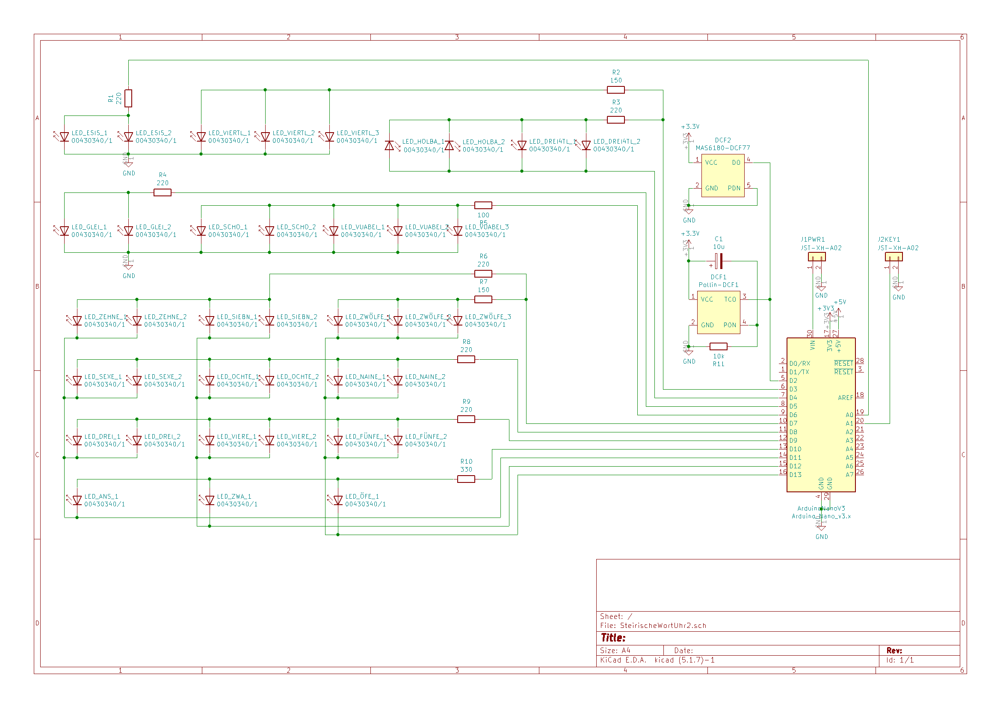

# SteirischeWortuhr
Wortuhr im steirischen Dialekt (Arduino/3D Druck)

Diese Wortuhr zeigt die aktuelle Uhrzeit auf Steirisch an. Dabei sind nicht nur die Zahlenworte in Mundart gehalten, sondern auch die eigentümliche- und für Nicht-Steirer wohl auch verwirrende Angabe der Uhrzeit ist dem lokalen Sprachgebrauch nachempfunden (14 Uhr 15 wird z.B. als "viertel Drei (!)" angegeben.

# Elektronik
Gesteuert wird die Uhr mit einem Arduino Nano und ein DCF-77 Funkuhrempfänger stellt die Zeit automatisch sekundengenau ein.

Sollte man nicht im 1500km Umkreis von Frankfurt wohnen, kann diese Antenne auch eingespart, und die Uhrzeit mit der Taste eingestellt werden.

Ich habe versucht, die Elektronik so simpel wie nur Möglich zu halten und auch auf LED Treiber verzichtet. Der Arduino treibt die eingesetzten 5mm LEDs ohne weitere Elektronik. Dafür habe ich Ultrabright LEDs eingesetzt (ca. 14000 mcd bei 20mA) und treibe diese mit 4mA um unter den Limits des Microcontrollers u bleiben. Da jedoch diese Ultrabright LEDs meistens einen sehr engen Abstrahlwinkel haben (was zu einer unregelmäßigen Ausleuchtung führen würde), habe ich die Köpfe der LEDs flach abgeschliffen.

Um die "Produktion" zu vereinfachen, habe ich eine eigene Platine fertigen lassen. Die KiCAD Schematics und PCB Daten sind hier herunterladbar, ebenso die Gerber Daten für die Platinenproduktion. Will man aber nur eine einzige Uhr herstellen, kann die Elektronik auch ganz einfach nur verkabelt werden. Der Verdratungsplan ist recht simpel:

# Bedienung der Wortuhr
Die Uhr wird über ein 12V Netzteil mit Strom versorgt und startet beim Einstecken des Netzteilsteckers automatisch. Wird während des Einschaltens der Taster gedrückt, startet der Selbstcheck (die Uhr läuft einen 12 Stunden Zyklus schnell durch).

Solange kein Zeitpacket empfangen wird blinkt "GLEI" im Sekundentakt. Wird ein Synchronisationssignal erkannt (jede volle Minute), erhöht sich die Blinkgeschindigkeit (500ms). Sobald die Zeitinformation empfangen wird (ab Sekunde 20), verdoppelt sich die Blinkgeschwindigkeit noch einmal, bis die gesamte Uhrzeit eingelesen wurde. Dann wird die empfangene Uhrzeit angezeigt.

Hinweis: Das DCF-77 Signal ist recht schwach, und daher die Ausrichtung der Antenne wichtig. Die Uhr solle für einen guten Empfang nach Frankfurt ausgerichtet sein (Anzeige in oder gegen Blickrichtung Frankfurt).

Ist ein Empfang nicht möglich, kann die Uhrzeit auch über den Taster eingestellt werden. Dazu muss der Taster 3 Sekunden gedrückt gehalten werden. "ES IS" fängt dann zu blinken an und mit weiteren kurzen Tastendrucks kann die Uhrzeit in 5 Minuten Schritten eingestellt werden. Erneutes 3 Sekunden Drücken speichert die Uhrzeit und "ES IS" leuchtet wieder konstant.
Sobald ein Zeitpacket empfangen wird, synchronisiert sich die Uhrzeit wieder automatisch.

Die Helligkeit der Anzeige kann in vier Stufen durch kurzes Drücken des Tasters eingestellt werden.

# 3D Druck

Die 3D Modelle und Druckdateien können hier heruntergeladen werden:

https://www.prusaprinters.org/prints/44454-steirische-wort-uhr-styrian-dialect-word-clock

